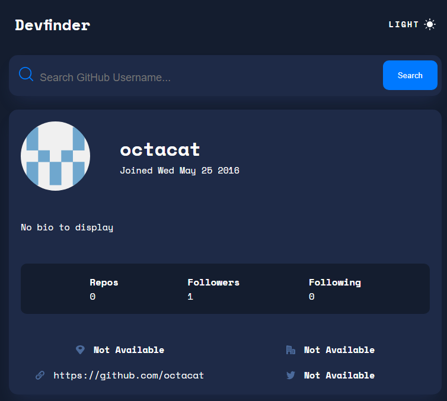
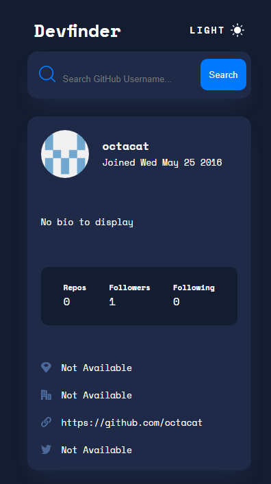

# Github User Search [January 18th 2023]

This React project is one of the junior projects from [Frontendmentor](https://www.frontendmentor.io/).

## Table of contents

- [Overview](#overview)
  - [Screenshot](#screenshot)
  - [Links](#links)
  - [Features](#features)
- [My process](#my-process)
  - [Built with](#built-with)
  - [What I learned](#what-i-learned)
  - [Continued development](#continued-development)
  - [Useful resources](#useful-resources)
- [Author](#author)
- [Acknowledgments](#acknowledgments)

## Overview

In this project, the goal was to build out a Github search app, the challenge was not to build it specifically in React but i wanted to further solidify the React concepts i know.

### Screenshots

### Links

- Live Site URL: [Github User Search](https://grand-maamoul-d485c7.netlify.app/)

### Features

- Displays a person Gihub profile stats.
- Light and dark mode.
- Error handling if user is not found.

## My process

I started by looking at figma files and writing down the possible routes I can take in terms of setting up my files. I then strctured my HTML file, then i used the figma file to get the appropriate colors and sizing to set up my CSS file. Some of the logic that went into the Javascript file were apart of the challenge but most of it was me adding my own logic in an effort to make it trully my creation.

### Built with

- HTML
- CSS
- Javascript
- React

### What I learned

I learned more about how to work with more complex React components.

### Continued development

The code will need additional refactoring to make it cleaner and more DRY.

### Useful resources

- [Frontendmentor](https://www.frontendmentor.io/)

## Author

- Jaron Denzel Young

## Acknowledgments

Thank you, Frontendmentor for being an awesome place to learn.
